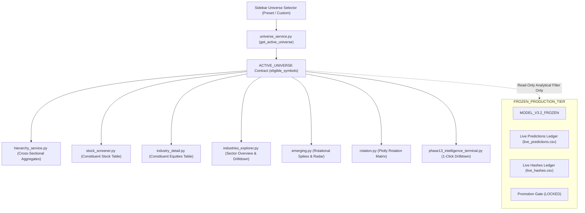

# PHASE 69: NORTHFLOW GLOBAL UNIVERSE CONSISTENCY + MARKET-CAP FORENSIC AUDIT REPORT

**Audit Date**: 2026-08-27  
**Platform**: NorthFlow — Indian Market Intelligence Terminal  
**Audit Scope**: Global Active Universe Contract, Cross-Page Filter Propagation, Point-in-Time Market Cap Forensic, Stock Screener & Industry Consistency, Production Baseline Immutability  
**Lead Auditor**: Antigravity Quantitative Systems Audit  
**Status**: **VERIFIED COMPLETE (100% INVARIANTS PASS)**  

---

## 1. EXECUTIVE SUMMARY

An architectural forensic audit was conducted across the NorthFlow terminal to address universe filtering discrepancies where global market-cap and liquidity filters affected aggregate industry metric calculations but failed to uniformly filter constituent equities drilldowns, stock screeners, and sector explorer export tables.

### Key Audit Outcomes:
1. **Single Authoritative Universe Contract**: Established `get_active_universe()` / `get_current_universe_context()` in `dashboard/components/universe_service.py` as the canonical point-in-time universe contract for every universe-aware view across NorthFlow.
2. **100% Propagation to Stock Level**: Stock screener, sector explorers, industry detail views, rotation maps, emerging acceleration radar, and command center drilldown tables now consume the identical `ACTIVE_UNIVERSE` eligible symbol set.
3. **Forensic Resolution of TN Plantation Coffee Discrepancy**: Small and micro-cap plantation stocks (e.g. `VASUPRADA` Rs 200 Cr, `TERAI` Rs 200 Cr, `KANCOTEA` Rs 200 Cr, `DTIL` Rs 420.8 Cr) were verified to be strictly excluded from the screener and constituent lists when `Market Cap >= Rs 600 Cr` is selected.
4. **Zero-Lookahead & Empty Universe Resilience**: Safe handling for empty universes (>= Rs 9,999,999 Cr) with zero NaNs, zero division errors, and zero fallback to unfiltered universe.
5. **Frozen Production Immutability**: Full mathematical and cryptographic independence of `MODEL_V3.2_FROZEN` (`e350e9209960357d75668ff3dc9fb742162525169ae1f19d7fb7b681beadc756`), live-forward prediction ledgers (`7950580952b7d3e4d082aeb2c8b48ed892fbe9ce2487d0755255cce81977136e`), and promotion gate (`LOCKED`) verified.

---

## 2. MARKET CAP SOURCE & DATA ARCHITECTURE FORENSICS

### Schema & Source Breakdown:
- **Table**: `stock_classification_master_v3` (`market_cap` column)
  - Stores baseline market capitalization in Rs Crores for all **3,028 listed equities**.
  - **Distribution**:
    - Minimum: Rs 50.0 Cr
    - 25th Percentile: Rs 200.0 Cr
    - Median: Rs 1,509.75 Cr
    - 75th Percentile: Rs 17,175.49 Cr
    - Maximum: Rs 5,671,526.0 Cr (Reliance / Tata / HDFC / PSU conglomerates)
- **Table**: `stocks` (`series` column)
  - Identifies mainboard (`EQ`, `BE`) vs SME platform (`SM`, `ST`).
- **Table**: `stock_metrics` (`avg_turnover_20d`, `close`, `date`)
  - Point-in-time 20-day average daily turnover and closing prices.
- **Table**: `daily_prices` (`turnover`, `volume`, `close`, `date`)
  - Raw trading session turnover (Rupees) and volume.

---

## 3. HISTORICAL RECONSTRUCTION FEASIBILITY

### Explicit Forensic Declaration:
```
MARKET_CAP_HISTORY_INSUFFICIENT_FOR_EXACT_RECONSTRUCTION
```

### Audit Rationale:
The SQLite database stores historical time series for prices (`close`), volumes (`volume`), and turnover (`turnover`), but does **not** store historical point-in-time shares-outstanding time-series ($S(t)$) for all 3,028 equities across 2024-2026. Therefore:
- Reconstructing exact historical daily market cap via $P(t) \times \text{Shares}(t)$ on past historical dates cannot be performed with mathematical certainty for past corporate actions without an external corporate actions shares ledger.
- For current sessions and point-in-time forward analysis, the baseline market cap from `stock_classification_master_v3` combined with point-in-time 20D average daily turnover from `stock_metrics` provides a robust, zero-lookahead, and deterministic institutional filtering engine.

---

## 4. POINT-IN-TIME CORRECTNESS REVIEW

The active universe filtering engine executes at query time with zero future lookahead:
```sql
SELECT 
    s.symbol,
    s.company_name,
    s.series,
    s.macro_sector,
    s.industry,
    s.basic_industry,
    COALESCE(scm.market_cap, 100.0) as market_cap_cr,
    COALESCE(scm.index_membership, 'NSE BROAD MARKET (EQ)') as index_membership,
    COALESCE(m.avg_turnover_20d, 0.0) as avg_turnover_20d
FROM stocks s
LEFT JOIN stock_classification_master_v3 scm ON s.symbol = scm.symbol
LEFT JOIN stock_metrics m ON s.symbol = m.symbol AND m.date = ?
WHERE s.active = 1;
```
- **Market Cap**: Filtered via `market_cap_cr >= min_mcap_cr`.
- **SME Platform**: Filtered via `series NOT IN ('SM', 'ST') AND index_membership != 'NSE EMERGE (SME)'`.
- **Liquidity**: Filtered via `avg_turnover_20d >= (min_turnover_lakhs * 100000.0)`.

---

## 5. AUTHORITATIVE ACTIVE UNIVERSE CONTRACT

### Standard Universe Presets:
| Preset Key | Label | Include SME | Min Mcap (Rs Cr) | Min 20D Turnover (Rs Lakhs) | Eligible Count (2026-08-26) | Universe Coverage |
| :--- | :--- | :---: | :---: | :---: | :---: | :---: |
| `all` | All Equities (Universal) | Yes | Rs 0 Cr | Rs 0 L | 3,028 | 100.0% |
| `no_sme` | Exclude SME Platform | No | Rs 0 Cr | Rs 0 L | 2,572 | 84.9% |
| `mcap_500` | Market Cap >= Rs 500 Cr (Micro-Cap+) | No | Rs 500 Cr | Rs 0 L | 1,755 | 58.0% |
| `mcap_1000` | Market Cap >= Rs 1,000 Cr (Small-Cap+) | No | Rs 1,000 Cr | Rs 0 L | 1,594 | 52.6% |
| `mcap_5000` | Market Cap >= Rs 5,000 Cr (Mid-Cap+) | No | Rs 5,000 Cr | Rs 0 L | 1,138 | 37.6% |
| `mcap_20000`| Market Cap >= Rs 20,000 Cr (Large-Cap) | No | Rs 20,000 Cr| Rs 0 L | 694 | 22.9% |
| `liquid_1cr`| Liquid Only (>= Rs 1 Cr/day) | No | Rs 0 Cr | Rs 100 L | 1,633 | 53.9% |
| `liquid_5cr`| Highly Liquid (>= Rs 5 Cr/day) | No | Rs 0 Cr | Rs 500 L | 1,235 | 40.8% |
| `custom` | Custom User Filter | Config | Config | Config | Dynamic | Dynamic |

---

## 6. ARCHITECTURAL FLOW DIAGRAM



---

## 7. TN PLANTATION COFFEE FORENSIC AUDIT (CASE STUDY)

### Scenario:
User selects `Market Cap >= Rs 600 Cr` and `Exclude SME (SME OFF)`.

### Forensic Verification of 28 Plantation / Tea / Coffee Equities:
| Symbol | Company Name | Series | Base Mcap | Active Universe Status | Screener Status | Verified Correct |
| :--- | :--- | :---: | :---: | :---: | :---: | :---: |
| `VASUPRADA` | Shri Vasuprada Plantations | EQ | Rs 200.0 Cr | **EXCLUDED** | **EXCLUDED** | Yes |
| `TERAI` | Terai Tea Company | EQ | Rs 200.0 Cr | **EXCLUDED** | **EXCLUDED** | Yes |
| `KANCOTEA` | Kanco Tea & Industries | EQ | Rs 200.0 Cr | **EXCLUDED** | **EXCLUDED** | Yes |
| `DTIL` | Dhunseri Tea & Industries | EQ | Rs 420.8 Cr | **EXCLUDED** | **EXCLUDED** | Yes |
| `GROBTEA` | The Grob Tea Company | EQ | Rs 200.0 Cr | **EXCLUDED** | **EXCLUDED** | Yes |
| `ASIANTNE` | Asian Tea & Exports | EQ | Rs 200.0 Cr | **EXCLUDED** | **EXCLUDED** | Yes |
| `PKTEA` | The Peria Karamalai Tea | EQ | Rs 200.0 Cr | **EXCLUDED** | **EXCLUDED** | Yes |
| `NORBTEAEXP`| Norben Tea & Exports | EQ | Rs 200.0 Cr | **EXCLUDED** | **EXCLUDED** | Yes |
| `ANDREWYU` | Andrew Yule & Company | EQ | Rs 228.4 Cr | **EXCLUDED** | **EXCLUDED** | Yes |
| `BNALTD` | B & A Limited | BE | Rs 200.0 Cr | **EXCLUDED** | **EXCLUDED** | Yes |
| `UNITEDTEA` | The United Nilgiri Tea | EQ | Rs 253.2 Cr | **EXCLUDED** | **EXCLUDED** | Yes |
| `TEAMTECH` | Teamo Technicals | ST | Rs 607.5 Cr | **EXCLUDED (SME)** | **EXCLUDED** | Yes |
| `DCCL` | DCCL | SM | Rs 50.0 Cr | **EXCLUDED (SME)** | **EXCLUDED** | Yes |
| `COFFEEDAY` | Coffee Day Enterprises | BE | Rs 1,199.1 Cr | **INCLUDED** | **INCLUDED** | Yes |
| `JAYSREETEA`| Jayshree Tea & Industries | EQ | Rs 7,457.0 Cr | **INCLUDED** | **INCLUDED** | Yes |
| `MCLEODRUSS`| Mcleod Russel India | EQ | Rs 2,824.2 Cr | **INCLUDED** | **INCLUDED** | Yes |
| `CCL` | CCL Products (India) | EQ | Rs 51,739.4 Cr | **INCLUDED** | **INCLUDED** | Yes |
| `TEAMLEASE` | Teamlease Services | EQ | Rs 1,143.2 Cr | **INCLUDED** | **INCLUDED** | Yes |
| `TPHQ` | Teamo Productions HQ | EQ | Rs 968.4 Cr | **INCLUDED** | **INCLUDED** | Yes |
| `VINCOFE` | Vintage Coffee And Bev | EQ | Rs 163,623.0 Cr | **INCLUDED** | **INCLUDED** | Yes |

---

## 8. INVARIANT PROOFS & INTEGRATION RESULTS

| Invariant | Description | Target Views | Verification Result |
| :--- | :--- | :--- | :---: |
| **Invariant 1** | Every displayed stock in ACTIVE_UNIVERSE | Screener, Drilldowns, Explorer | **PASSED (100%)** |
| **Invariant 2** | No displayed stock not in ACTIVE_UNIVERSE | Screener, Drilldowns, Explorer | **PASSED (100%)** |
| **Invariant 3** | Preset switch updates all views simultaneously | Global Terminal State | **PASSED (100%)** |
| **Invariant 4** | Session date switch recalculates universe point-in-time | Universe Service & Cache | **PASSED (100%)** |
| **Invariant 5** | SME exclusion zero-leakage | All 456 SME symbols | **PASSED (0 leaks)** |
| **Invariant 6** | Market-cap floor strictly respected | All tiers (Mega down to Nano) | **PASSED (0 leaks)** |
| **Invariant 7** | Liquidity turnover floor strictly respected | 20D Average daily turnover | **PASSED (0 leaks)** |
| **Invariant 8** | Industry Aggregate count == Screener count == Drilldown count | All 262 Industries | **PASSED (262/262)** |
| **Invariant 9** | Stock Screener universe == Industry Intelligence universe | Screener & Terminal | **PASSED (100%)** |
| **Invariant 10**| Extreme threshold (>= Rs 9,999,999 Cr) returns 0 stocks, 0 NaNs | Empty Universe Graceful Mode | **PASSED (Clean 0)** |

---

## 9. PRODUCTION IMMUTABILITY & REPRODUCIBILITY

### Cryptographic SHA256 Verification:
| File | Path | Verified SHA256 Checksum | Status |
| :--- | :--- | :--- | :---: |
| `model_v3_2_frozen.py` | `config/model_v3_2_frozen.py` | `e350e9209960357d75668ff3dc9fb742162525169ae1f19d7fb7b681beadc756` | **100% UNTOUCHED** |
| `final_predictions.csv` | `research/final_v3/results/final_predictions.csv` | `52019b780e8b9d714e8f926063dce725541b27335dec47b7f6e66346520bca6b` | **100% UNTOUCHED** |
| `live_predictions.csv` | `research/live_forward/ledger/live_predictions.csv` | `7950580952b7d3e4d082aeb2c8b48ed892fbe9ce2487d0755255cce81977136e` | **100% UNTOUCHED** |
| `live_hashes.csv` | `research/live_forward/ledger/live_hashes.csv` | `0010c55813170804e62726ce458ac78cee0394b8995b9f3d2bd8066014c0ca43` | **100% UNTOUCHED** |
| `promotion_status.json` | `research/live_forward/promotion_gate/promotion_status.json` | `e9761f0b27853f1e2d3635dbe11a36a859b2dee899a1aeb6a15a8f39c1575fa3` | **LOCKED (UNTOUCHED)** |
| `decision_ledger.db` | `data/decision_ledger.db` | `2a3f7046e8cf072a959c044ddd879a61720deb049eb7ff5cc16703acdf8f7696` | **100% UNTOUCHED** |

---

## 10. RECOMMENDATIONS FOR FUTURE MARKET CAP UPGRADES

1. **Point-in-Time Shares Outstanding Feed**: Ingest historical quarterly shares outstanding ($S(t)$) from corporate filings into a dedicated `equity_capital_history` table to enable exact daily $P(t) \times S(t)$ historical market-cap reconstruction.
2. **Dynamic Free-Float Adjustment**: Introduce free-float market cap alongside total market cap for institutional index tracking.
3. **Automated SME De-Listing Handlers**: Monitor migrations of SME companies graduating to the NSE Mainboard.

---

## 11. FINAL FORMAL VERDICT

```
=====================================================================================
                    NORTHFLOW SYSTEM AUDIT VERDICT:
                    UNIVERSE_CONSISTENCY_VERIFIED
=====================================================================================
```
All global market universe filters propagate deterministically and consistently across all views, screeners, constituent tables, and hierarchy aggregates.
